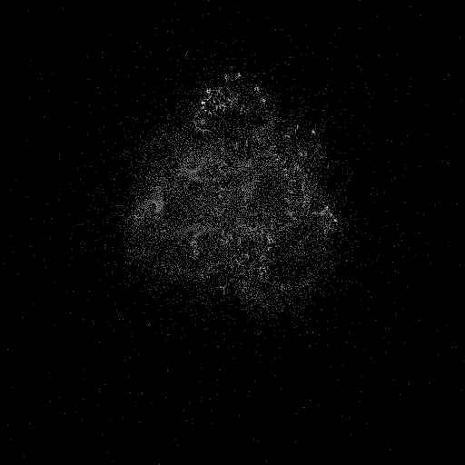

---
tags:
  - fractal
  - buddhabrot
---

# Coverage-Guided Buddhabrot

## Summary
A Buddhabrot rendering variant that keeps sampling escaping Mandelbrot orbits until a specified image-coverage target is reached, making the stopping condition density-driven rather than exposure-driven.

## Formula / Rule
```
z_{n+1} = z_n^2 + c, \quad z_0 = 0; accumulate escaping orbit points until a target percentage of pixels is hit
```

## Mathematical Background
The Buddhabrot is not a direct membership image of the Mandelbrot set. It first rejects non-escaping parameters, then plots the intermediate orbit positions of escaping samples. This turns the escape-time process into a trajectory-density image: bright structures mark regions frequently crossed by escaping orbits.

## Rendering Method
Escape-time algorithm on CPU with 512×512 resolution. This variant stops when at least 5% of pixels have received one or more orbit hits, rather than stopping at a fixed maximum exposure. The coverage target makes stochastic runs more reproducible in density while still allowing individual bright regions to accumulate multiple hits.

## Rendering Behavior
- `cutoff=20` suppresses the earliest orbit points so the render emphasizes longer escaping trajectories.
- `coverage=5` targets roughly 13,108 covered pixels at 512×512 resolution.
- The final `log1p-mapped` pass compresses high hit counts so both faint nebular structure and dense orbit lanes remain visible.

## Parameters
| Setting | Value |
|---|---|
    | width | 512 |
    | height | 512 |
    | cutoff | 20 |
    | bailout | 600 |
    | coverage | 5 |
    | highest | 35 |

## Coloring Techniques
- log1p-mapped exposure

## C# Implementation Notes
- Implemented as a standalone fractal class in `Fractals/`
- Bailout set to 600 to limit orbit tracing

## Known Variations
- Default viewport and parameters as defined in `fractal_queue.json`

## Interesting Coordinates or Presets


## Sources
- Wikipedia: [Escape_time fractal](https://en.wikipedia.org/wiki/Escape-time_fractal)

## Related Notes
- [[mandelbrot]]
- [[julia]]
- [[burningship]]
