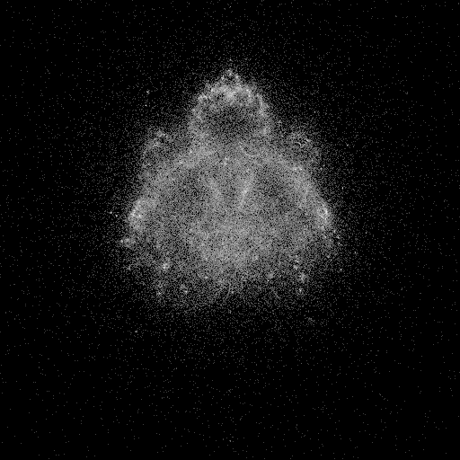

---
tags:
  - fractal
  - buddhabrot
---

# Buddhabrot

## Summary
A trajectory-density rendering of the Mandelbrot iteration. Instead of coloring c directly, it accumulates the paths of escaping orbits, revealing ghostly basin structure around the Mandelbrot set.

## Formula / Rule
```
z_{n+1} = z_n^2 + c, \quad z_0 = 0; plot escaping orbit points instead of parameter points
```

## Mathematical Background
A trajectory-density rendering of the Mandelbrot iteration. Instead of coloring c directly, it accumulates the paths of escaping orbits, revealing ghostly basin structure around the Mandelbrot set.

## Rendering Method
Escape-time algorithm on CPU with 512×512 resolution.

## Parameters
| Setting | Value |
|---|---|
    | width | 512 |
    | height | 512 |
    | cutoff | 20 |
    | bailout | 600 |
    | highest | 35 |

## Coloring Techniques
- log1p-mapped exposure

## C# Implementation Notes
- Implemented as a standalone fractal class in `Fractals/`
- Bailout set to 600 to limit orbit tracing

## Known Variations
- Default viewport and parameters as defined in `fractal_queue.json`

## Interesting Coordinates or Presets


## Sources
- Wikipedia: [Escape_time fractal](https://en.wikipedia.org/wiki/Escape-time_fractal)

## Related Notes
- [[mandelbrot]]
- [[julia]]
- [[burningship]]
