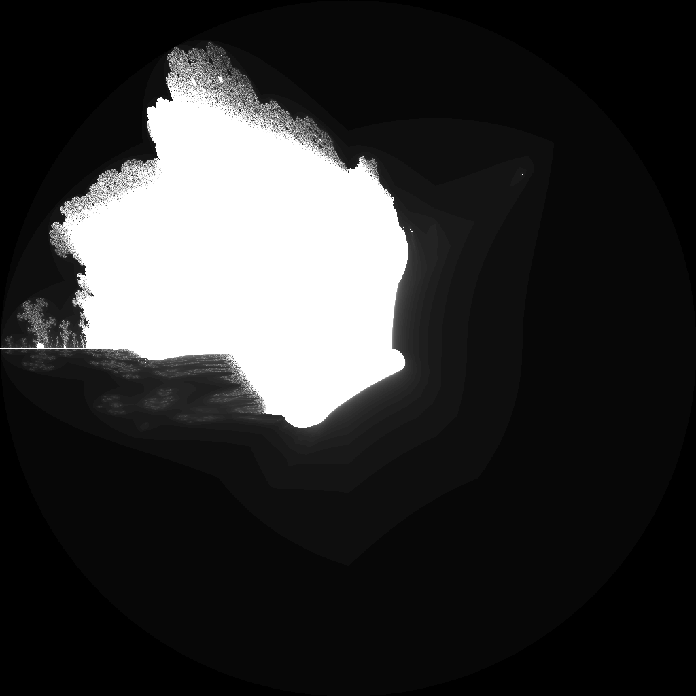

---
tags:
  - fractal
  - mandelbrot
---

# Buffalo Mandelbrot

## Summary
A Mandelbrot-family escape-time fractal that folds both real and imaginary components after squaring. The fold creates horn-like lobes and mirrored filament structures reminiscent of a buffalo silhouette.

## Formula / Rule
```
z_{n+1} = |\operatorname{Re}(z_n^2)| + i|\operatorname{Im}(z_n^2)| + c, \quad z_0 = 0
```

## Mathematical Background
The Buffalo Mandelbrot is usually grouped with quadratic folding variants such as [[Burning Ship]] and [[Celtic Mandelbrot]]. Instead of folding `z` before squaring, this variant squares first and then applies absolute values to both the real and imaginary components of `z^2`. That post-square fold changes the symmetry of the escape boundary and tends to form paired horn-like lobes, cusps, and stacked bands rather than the classic cardioid-and-bulb outline.

## Rendering Method
Escape-time algorithm on CPU with 1024×1024 resolution.

## Parameters
| Setting | Value |
|---|---|
    | width | 1024 |
    | height | 1024 |
    | bailout | 500 |
    | highest | 80 |
    | min-real | -2.0 |
    | max-real | 2.0 |
    | min-imaginary | -2.0 |
    | max-imaginary | 2.0 |

## Coloring Techniques
- log1p-mapped exposure

## C# Implementation Notes
- Implemented as a standalone fractal class in `Fractals/`
- Bailout set to 500 to limit orbit tracing

## Known Variations
- **Buffalo Mandelbrot:** post-square absolute-value fold, `|Re(z^2)| + i|Im(z^2)| + c`.
- **Burning Ship:** pre-square fold, `(|Re(z)| + i|Im(z)|)^2 + c`, producing sharper ship-like wakes.
- **Celtic Mandelbrot:** folds only the real component of `z^2`, retaining a more Mandelbrot-like silhouette.

## Interesting Coordinates or Presets


## Sources
- Wikipedia: [Escape_time fractal](https://en.wikipedia.org/wiki/Escape-time_fractal)

## Related Notes
- [[mandelbrot]]
- [[julia]]
- [[burningship]]
