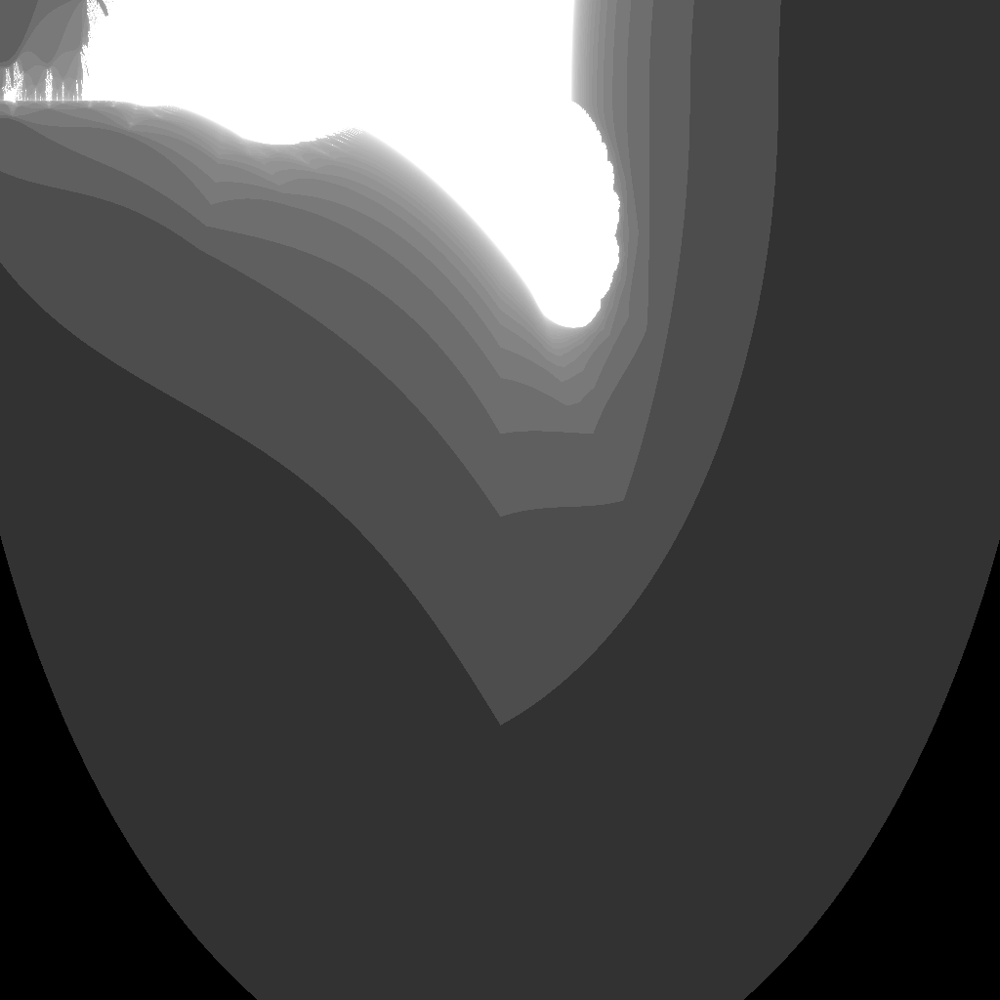

---
tags:
  - fractal
  - burningship
---

# Burning Ship

## Summary
A variant that takes the absolute value of real and imaginary parts before squaring, producing fractal 'smoke' and ship-like shapes.

## Formula / Rule
```
z_{n+1} = (|Re(z_n)| + i|Im(z_n)|)^2 + c
```

## Mathematical Background
A variant that takes the absolute value of real and imaginary parts before squaring, producing fractal 'smoke' and ship-like shapes.

## Rendering Method
Escape-time algorithm on CPU with 1024×1024 resolution.

## Parameters
| Setting | Value |
|---|---|
    | width | 1024 |
    | height | 1024 |
    | bailout | 500 |
    | highest | 50 |

## Coloring Techniques
- log1p-mapped exposure

## C# Implementation Notes
- Implemented as a standalone fractal class in `Fractals/`
- Bailout set to 500 to limit orbit tracing

## Known Variations
- Default viewport and parameters as defined in `fractal_queue.json`

## Interesting Coordinates or Presets


## Sources
- Wikipedia: [Escape_time fractal](https://en.wikipedia.org/wiki/Escape-time_fractal)

## Related Notes
- [[mandelbrot]]
- [[julia]]
- [[tricorn]]
