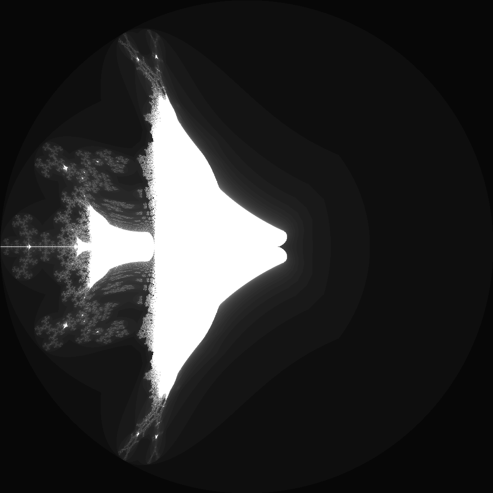

---
tags:
  - fractal
  - mandelbrot
---

# Celtic Mandelbrot

## Summary
A Mandelbrot-family escape-time fractal that folds the real component of z^2 before adding c, producing Celtic-knot-like lobes and mirrored boundary filaments.

## Formula / Rule
```
z_{n+1} = |\operatorname{Re}(z_n^2)| + i\operatorname{Im}(z_n^2) + c, \quad z_0 = 0
```

## Mathematical Background
The Celtic Mandelbrot belongs to the family of folded Mandelbrot variants: it keeps the usual complex squaring step but applies an absolute-value fold to the real part of `z^2` before adding the parameter `c`. This breaks the analytic structure of the classic [[mandelbrot]] iteration while preserving escape-time behavior, so the result has Mandelbrot-like bulbs mixed with sharp cusps, bilateral bridges, and knot-like repeated motifs. It is closely related to other folded variants such as the Perpendicular Mandelbrot and Buffalo fractal.

## Rendering Method
Escape-time algorithm on CPU with 1024×1024 resolution.

## Parameters
| Setting | Value |
|---|---|
    | width | 1024 |
    | height | 1024 |
    | bailout | 500 |
    | highest | 50 |
    | min-real | -2.0 |
    | max-real | 2.0 |
    | min-imaginary | -2.0 |
    | max-imaginary | 2.0 |

## Coloring Techniques
- log1p-mapped exposure

## C# Implementation Notes
- Implemented as a standalone fractal class in `Fractals/`
- Bailout set to 500 to limit orbit tracing

## Known Variations
- **Perpendicular Mandelbrot:** folds the imaginary component interaction instead of only the real component of `z^2`.
- **Buffalo fractal:** applies absolute-value folds to both real and imaginary components before adding `c`.
- **Celtic Julia sets:** keep the same Celtic recurrence but use each pixel as `z_0` with a fixed complex parameter `c`.

## Interesting Coordinates or Presets


## Sources
- Wikipedia: [Escape_time fractal](https://en.wikipedia.org/wiki/Escape-time_fractal)

## Related Notes
- [[mandelbrot]]
- [[julia]]
- [[burningship]]
