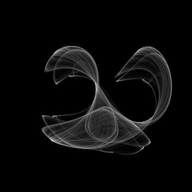

---
tags:
  - fractal
  - strange-attractor
---

# Clifford Attractor

## Summary
Pickover-associated sine/cosine strange attractor density field.

## Formula / Rule
```
x_{n+1}=sin(a y_n)+c cos(a x_n); y_{n+1}=sin(b x_n)+d cos(b y_n)
```

## Mathematical Background
Pickover-associated sine/cosine strange attractor density field.

## Rendering Method
Escape-time algorithm on CPU with 384×384 resolution.

## Parameters
| Setting | Value |
|---|---|
    | width | 384 |
    | height | 384 |
    | bailout | 900 |
    | highest | 50 |

## Coloring Techniques
- log1p-mapped exposure

## C# Implementation Notes
- Implemented as a standalone fractal class in `Fractals/`
- Bailout set to 900 to limit orbit tracing

## Known Variations
- Default viewport and parameters as defined in `fractal_queue.json`

## Interesting Coordinates or Presets


## Sources
- Wikipedia: [Escape_time fractal](https://en.wikipedia.org/wiki/Escape-time_fractal)

## Related Notes
- [[mandelbrot]]
- [[julia]]
- [[burningship]]
