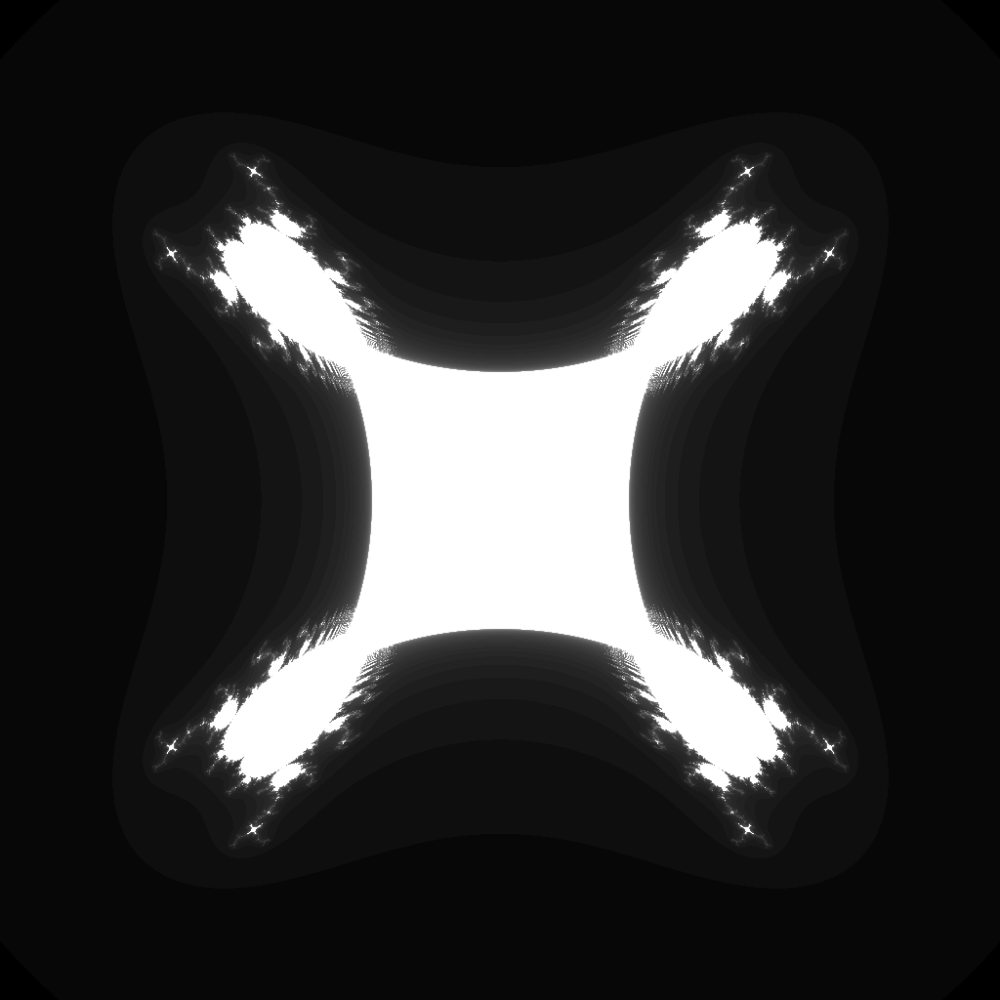

---
tags:
  - fractal
  - tricorn
---

# Cubic Tricorn

## Summary
A degree-3 multicorn: the anti-holomorphic analogue of the cubic Multibrot set. Conjugating the orbit before cubing produces reflected lobes, parabolic arcs, and tricorn-like symmetry in a threefold parameter plane.

## Formula / Rule
```
z_{n+1} = \overline{z_n}^3 + c, \quad z_0 = 0
```

## Mathematical Background
A degree-3 multicorn: the anti-holomorphic analogue of the cubic Multibrot set. Conjugating the orbit before cubing produces reflected lobes, parabolic arcs, and tricorn-like symmetry in a threefold parameter plane.

## Family Context
The classic [[tricorn]] uses the anti-holomorphic quadratic map `z -> conjugate(z)^2 + c`. This preset lifts the same conjugated-orbit idea to degree 3, so it is best read as a cubic member of the multicorn family rather than as a simple power-3 Mandelbrot. Anti-holomorphic maps often show parabolic arcs and mirrored satellite structure that differ from holomorphic [[multibrot3]] lobes.

## Rendering Method
Escape-time algorithm on CPU with 1024×1024 resolution.

## Parameters
| Setting | Value |
|---|---|
    | width | 1024 |
    | height | 1024 |
    | bailout | 500 |
    | highest | 80 |
    | min-real | -1.5 |
    | max-real | 1.5 |
    | min-imaginary | -1.5 |
    | max-imaginary | 1.5 |

## Coloring Techniques
- log1p-mapped exposure

## C# Implementation Notes
- Implemented as a standalone fractal class in `Fractals/`
- Bailout set to 500 to limit orbit tracing

## Known Variations
- **Quadratic Tricorn / Mandelbar:** `z_{n+1} = \overline{z_n}^2 + c`.
- **Higher-degree multicorns:** `z_{n+1} = \overline{z_n}^d + c` for integer degree `d > 2`.
- **Holomorphic cubic Multibrot:** `z_{n+1} = z_n^3 + c`, useful as a visual comparison because it keeps the same power but removes conjugation.

## Interesting Coordinates or Presets


## Sources
- Wikipedia: [Tricorn (mathematics)](https://en.wikipedia.org/wiki/Tricorn_(mathematics))
- Wikipedia: [Escape-time fractal](https://en.wikipedia.org/wiki/Escape-time_fractal)

## Related Notes
- [[mandelbrot]]
- [[julia]]
- [[burningship]]
