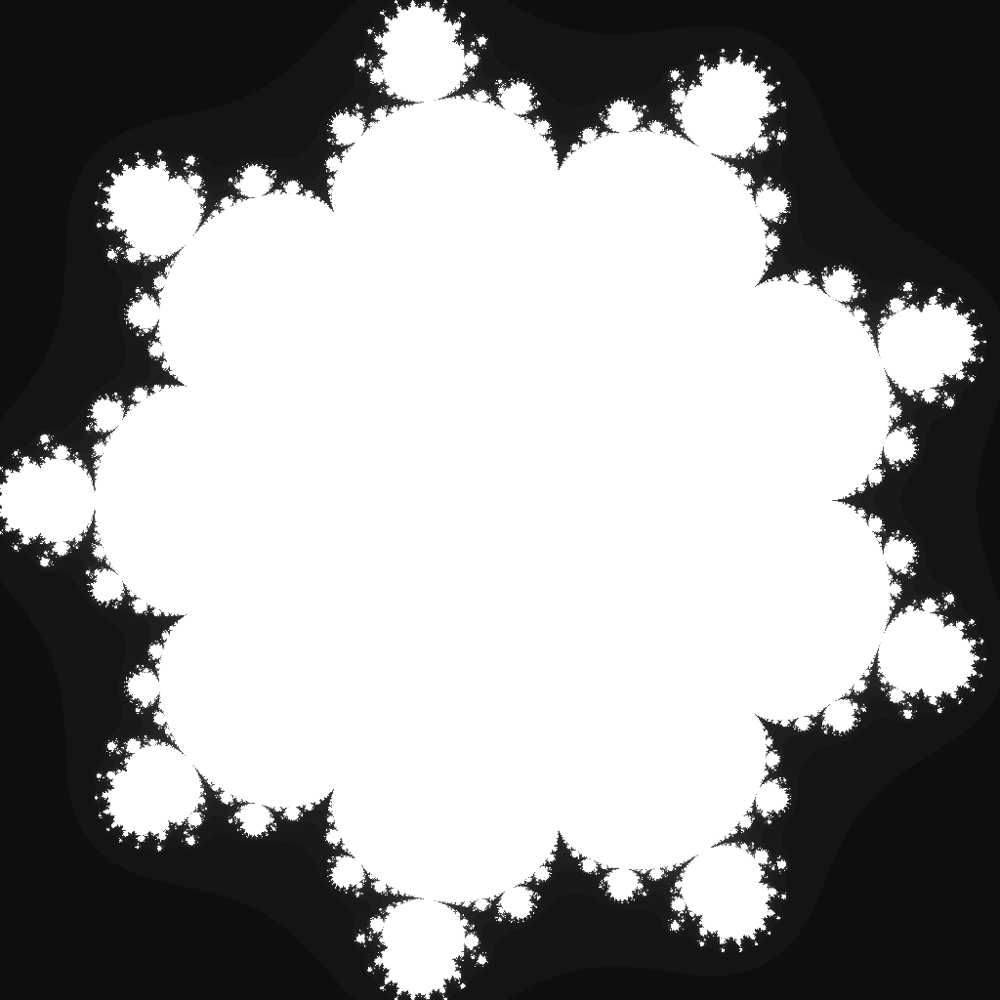

---
tags:
  - fractal
  - multibrot
---

# Decic Multibrot

## Summary
The degree-10 Mandelbrot-family parameter set. Raising each orbit to the tenth power produces ninefold rotational structure, compact lobes, and extremely fine tendrils around the escape boundary.

## Formula / Rule
```
z_{n+1} = z_n^10 + c, \quad z_0 = 0
```

## Mathematical Background
The Decic Multibrot is the connectedness locus for the unicritical polynomial family `z \mapsto z^10 + c`. Like other degree-`d` Multibrot sets, its parameter-plane symmetry is `d - 1`, so the degree-10 case arranges nine narrow arms around a compact central body. The higher power makes exterior escape bands rapidly thin out, which rewards a slightly tighter symmetric viewport than the quadratic Mandelbrot.

## Rendering Method
Escape-time algorithm on CPU with 1024×1024 resolution.

## Parameters
| Setting | Value |
|---|---|
    | width | 1024 |
    | height | 1024 |
    | bailout | 500 |
    | highest | 80 |
    | min-real | -1.05 |
    | max-real | 1.05 |
    | min-imaginary | -1.05 |
    | max-imaginary | 1.05 |

## Coloring Techniques
- log1p-mapped exposure

## C# Implementation Notes
- Implemented as a standalone fractal class in `Fractals/`
- Bailout set to 500 to limit orbit tracing

## Known Variations
- Default viewport and parameters as defined in `fractal_queue.json`

## Interesting Coordinates or Presets


## Sources
- Wikipedia: [Escape_time fractal](https://en.wikipedia.org/wiki/Escape-time_fractal)

## Related Notes
- [[mandelbrot]]
- [[julia]]
- [[burningship]]
