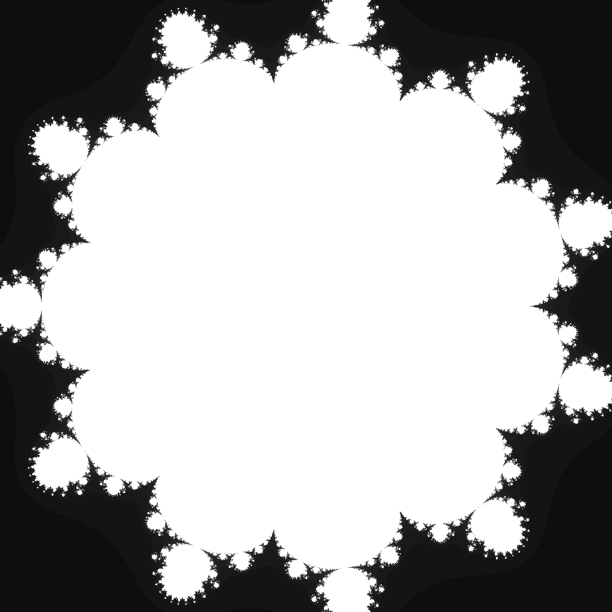

---
tags:
  - fractal
  - multibrot
---

# Duodecic Multibrot

## Summary
The degree-12 Mandelbrot-family parameter set. Raising each orbit to the twelfth power produces elevenfold rotational structure, compact lobes, and extremely fine tendrils around the escape boundary.

## Formula / Rule
```
z_{n+1} = z_n^12 + c, \quad z_0 = 0
```

## Mathematical Background
The Duodecic Multibrot is the degree-12 member of the Multibrot family `z -> z^d + c`. For degree `d`, the parameter plane has `(d - 1)`-fold rotational symmetry, so this render emphasizes eleven repeating arms around the central component. Even degrees also make the image symmetric across both coordinate axes, which is why a square `[-1, 1] × [-1, 1]` viewport captures the primary structure cleanly.

## Rendering Method
Escape-time algorithm on CPU with 1024×1024 resolution.

## Parameters
| Setting | Value |
|---|---|
    | width | 1024 |
    | height | 1024 |
    | bailout | 500 |
    | highest | 80 |
    | min-real | -1.0 |
    | max-real | 1.0 |
    | min-imaginary | -1.0 |
    | max-imaginary | 1.0 |

## Coloring Techniques
- log1p-mapped exposure

## C# Implementation Notes
- Implemented as a standalone fractal class in `Fractals/`
- Bailout set to 500 to limit orbit tracing

## Known Variations
- Default viewport and parameters as defined in `fractal_queue.json`

## Interesting Coordinates or Presets


## Sources
- Wikipedia: [Escape_time fractal](https://en.wikipedia.org/wiki/Escape-time_fractal)

## Related Notes
- [[mandelbrot]]
- [[julia]]
- [[burningship]]
