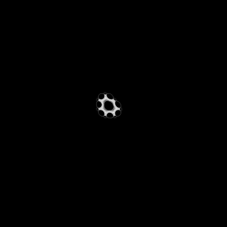

---
tags:
  - fractal
  - hopalong
---

# Hopalong Attractor

## Summary
Barry Martin Hopalong attractor rendered as a density field.

## Formula / Rule
```
x_{n+1}=y_n-sgn(x_n)sqrt(|b x_n-c|); y_{n+1}=a-x_n
```

## Mathematical Background
The Hopalong attractor is a two-dimensional iterative map introduced by Barry Martin and often called the Martin map. Unlike parameter-plane escape-time sets, it is best viewed as an orbit-density strange attractor: many nearby seeds repeatedly "hop" through the plane, and frequently visited cells form the visible structure. The square-root fold and `sgn(x)` term make small parameter changes produce visibly different woven loops, sprays, and bilateral motifs.

## Rendering Method
CPU orbit-density histogram at 384×384 resolution. This preset traces bounded Hopalong orbits, discards the first few transient steps, maps visits from `[-18,18] × [-18,18]` into pixels, and shades the accumulated exposure with log1p mapping.

## Parameters
| Setting | Value |
|---|---|
    | width | 384 |
    | height | 384 |
    | bailout | 900 |
    | highest | 50 |

## Coloring Techniques
- log1p-mapped exposure

## C# Implementation Notes
- Implemented as a standalone fractal class in `Fractals/`
- Bailout set to 900 to limit orbit tracing

## Known Variations
- The classic Martin-map family varies the constants `a`, `b`, and `c`; different triples can produce dense carpets, braided loops, or sparse filamentary sprays.
- This render uses preset `a=-2.0`, `b=-0.33`, `c=0.01`, with plotting window `[-18,18] × [-18,18]`.

## Interesting Coordinates or Presets


## Sources
- Barry Martin's Hopalong Orbits Visualizer: https://iacopoapps.appspot.com/hopalongwebgl/
- Maple Help, “Hopalong Attractor”: http://de.maplesoft.com/support/help/Maple/view.aspx?path

## Related Notes
- [[mandelbrot]]
- [[julia]]
- [[burningship]]
