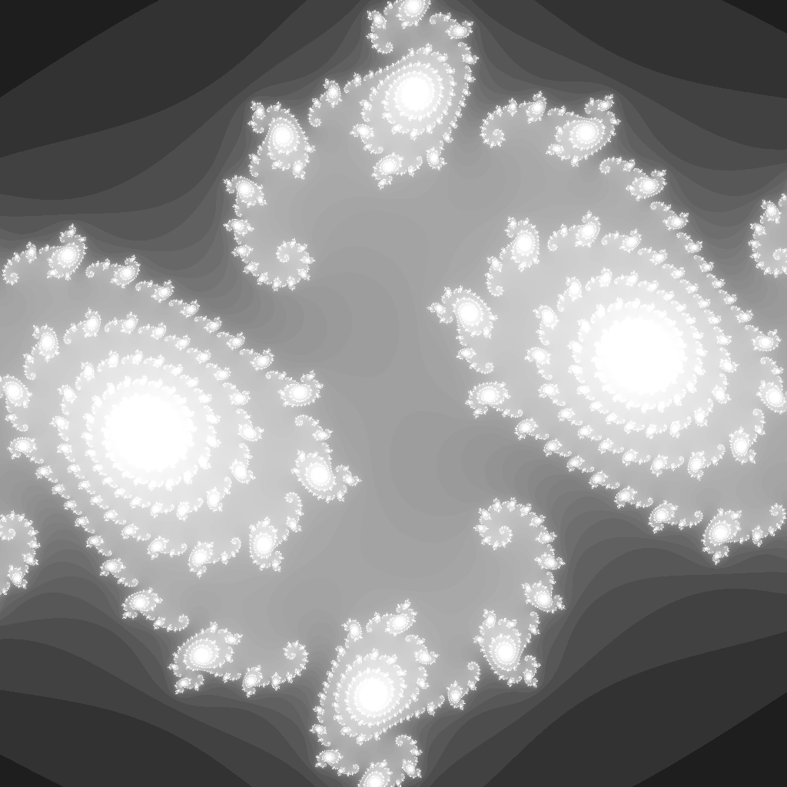

---
tags:
  - fractal
  - julia
---

# Julia Set

## Summary
A connected Julia set for a parameter inside the Mandelbrot set. Shows dendritic filaments and spiral structure.

## Formula / Rule
```
z_{n+1} = z_n^2 + c, \quad c = -0.75 + 0.156i
```

## Mathematical Background
A connected Julia set for a parameter inside the Mandelbrot set. Shows dendritic filaments and spiral structure.

## Rendering Method
Escape-time algorithm on CPU with 1024×1024 resolution.

## Parameters
| Setting | Value |
|---|---|
    | width | 1024 |
    | height | 1024 |
    | highest | 100 |

## Coloring Techniques
- log1p-mapped exposure

## C# Implementation Notes
- Implemented as a standalone fractal class in `Fractals/`

## Known Variations
- Default viewport and parameters as defined in `fractal_queue.json`

## Interesting Coordinates or Presets


## Sources
- Wikipedia: [Escape_time fractal](https://en.wikipedia.org/wiki/Escape-time_fractal)

## Related Notes
- [[mandelbrot]]
- [[burningship]]
- [[tricorn]]
