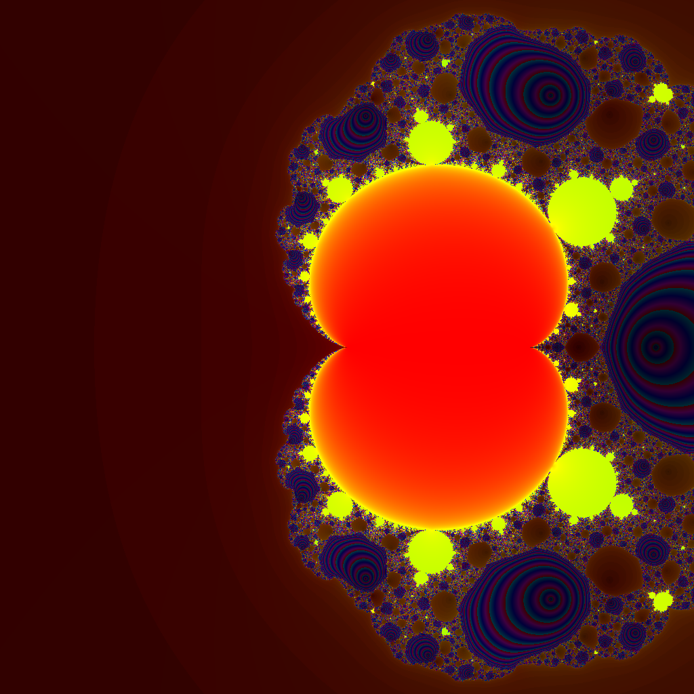

---
tags:
  - fractal
  - fractal/magnet
  - fractal/rendering
  - csharp
  - math
  - visualization
---

# Magnet Type I Fractal

## Summary

The Magnet Type I fractal is an exotic rational-map parameter-plane fractal associated with formulas used in magnetic renormalization transformations and complex phase-transition studies. Each pixel is a complex parameter `c`; starting from `z_0 = 0`, the rational recurrence is iterated and classified by convergence toward the attracting fixed point `z = 1`, singular behavior near poles, or failure to converge within the iteration limit.

Rendered output:



## Formula / Rule

```text
z_{n+1} = ((z_n^2 + c - 1) / (2 z_n + c - 2))^2,  z_0 = 0
```

A point is treated as converged when `|z_n - 1|^2 < 1e-12`. The implementation also guards against near-zero denominators and runaway orbits.

## Mathematical Background

Unlike polynomial escape-time sets such as the [[Mandelbrot Set]], Magnet Type I is generated by a rational map. The denominator introduces poles and discontinuities, producing sharply detailed phase boundaries, bubble chains, and nested circular basins. Paul Bourke notes that these “magnet” formulas are derived from hierarchical-lattice magnetic renormalization transformations; moving the problem into the complex plane exposes fractal phase boundaries related in spirit to Yang-Lee style complex phase-transition analysis.

## Rendering Method

- Family: rational-map escape/convergence-time fractal.
- Plane: parameter plane, where each pixel supplies `c`.
- Initial value: `z_0 = 0`.
- Iteration stops when:
  - `z` converges close to `1`,
  - denominator magnitude becomes too small,
  - the orbit runs away / becomes non-finite, or
  - `bailout` iterations are reached.
- Rendered with the CPU sandbox and `distance-exposure-hsv` coloring.

## Parameters

| Setting | Value |
|---|---:|
| width | 1024 |
| height | 1024 |
| bailout | 250 |
| highest | 250 |
| min-real | -2.25 |
| max-real | 2.25 |
| min-imaginary | -2.25 |
| max-imaginary | 2.25 |
| convergence epsilon squared | 1e-12 |
| denominator epsilon squared | 1e-24 |

## Coloring Techniques

- `exposure`: number of rational-map iterations before convergence or termination.
- `distance`: logarithm of accumulated orbit motion plus final distance to the fixed point at `1`.
- Rendered image uses `distance-exposure-hsv`, combining distance structure with convergence-time intensity.

## C# Implementation Notes

Implemented in `Fractals/MagnetType1.cs` as `MagnetType1 : Fractal`.

Important details:

- Uses explicit real/imaginary arithmetic for the rational division to avoid adding new dependencies.
- Avoids constructor-time allocation; `Fractal.Init` allocates `domain`, `exposure`, `distance`, and `canvas`.
- CLI keyword added: `magnet1`.
- The `magnet1` CLI case respects viewport settings (`min-real`, `max-real`, `min-imaginary`, `max-imaginary`), unlike some older fixed-viewport sandbox fractals.

Example command:

```bash
./bin/Debug/net10.0-windows/Sandbox.exe magnet1 width=1024 height=1024 bailout=250 highest=250 min-real=-2.25 max-real=2.25 min-imaginary=-2.25 max-imaginary=2.25 render save distance-exposure-hsv draw
```

## Known Variations

- **Magnet Type II** uses a higher-degree rational map:

```text
z_{n+1} = ((z_n^3 + 3(c - 1)z_n + (c - 1)(c - 2)) /
           (3z_n^2 + 3(c - 2)z_n + (c - 1)(c - 2) + 1))^2
```

- Different convergence tolerances emphasize basin interiors or boundary filaments.
- Distance-only, contour, and histogram-equalized shaders can reveal different pole/basin structures.

## Interesting Coordinates or Presets

### Full symmetric view

```text
keyword=magnet1
width=1024
height=1024
bailout=250
highest=250
min-real=-2.25
max-real=2.25
min-imaginary=-2.25
max-imaginary=2.25
shader=distance-exposure-hsv
```

This view shows a large two-lobed attracting basin, bright satellite disks, dense phase-boundary filigree, and nested ring structures near rational-map singularities.

## Sources

- Paul Bourke, “Magnet 1 / Magnet 2,” January 2018: https://paulbourke.net/fractals/magnet/
- FractInt background quoted by Bourke on magnetic renormalisation transformations and complex phase boundaries.

## Related Notes

Related: [[Mandelbrot Set]], [[Newton Fractal]], [[Escape-Time Algorithm]], [[Smooth Coloring]], [[Rational Maps]]
