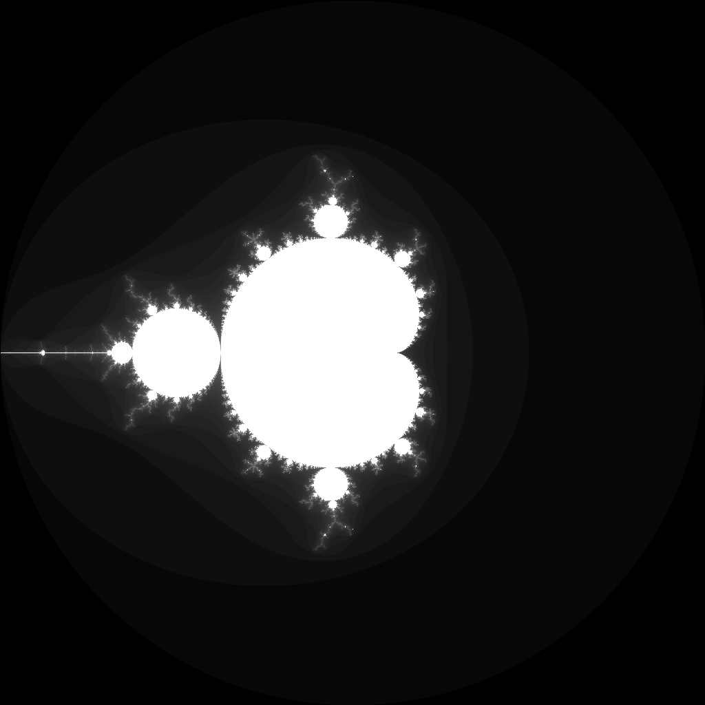

---
tags:
  - fractal
  - mandelbrot
---

# Classic Mandelbrot Set

## Summary
The quintessential escape-time fractal. Points in the complex plane are tested for escape under repeated squaring. The boundary contains infinite detail.

## Formula / Rule
```
z_{n+1} = z_n^2 + c, \quad z_0 = 0
```

## Mathematical Background
The quintessential escape-time fractal. Points in the complex plane are tested for escape under repeated squaring. The boundary contains infinite detail.

## Rendering Method
Escape-time algorithm on CPU with 1024×1024 resolution.

## Parameters
| Setting | Value |
|---|---|
    | width | 1024 |
    | height | 1024 |
    | bailout | 500 |
    | highest | 50 |

## Coloring Techniques
- log1p-mapped exposure

## C# Implementation Notes
- Implemented as a standalone fractal class in `Fractals/`
- Bailout set to 500 to limit orbit tracing

## Known Variations
- Default viewport and parameters as defined in `fractal_queue.json`

## Interesting Coordinates or Presets


## Sources
- Wikipedia: [Escape_time fractal](https://en.wikipedia.org/wiki/Escape-time_fractal)

## Related Notes
- [[julia]]
- [[burningship]]
- [[tricorn]]
