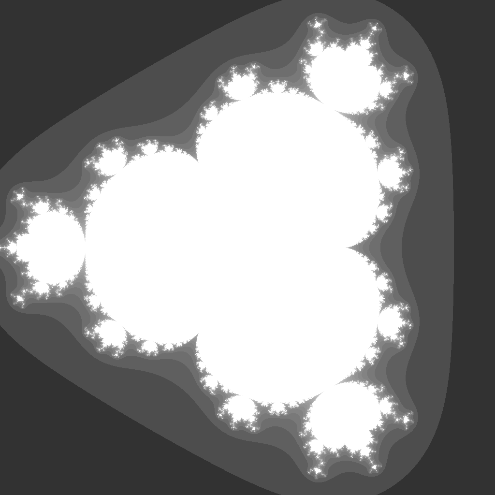

---
tags:
  - fractal
  - multibrot
---

# Multibrot-4

## Summary
The degree-4 analogue of the Mandelbrot set. Raising each orbit to the fourth power produces a three-armed symmetric parameter-plane set with thinner lobes and sharper branching than the quadratic Mandelbrot.

## Formula / Rule
```
z_{n+1} = z_n^4 + c
```

## Mathematical Background
Multibrot sets generalize the [[Mandelbrot Set]] by replacing the quadratic term with `z^d`. For `d = 4`, the parameter plane has three-fold rotational symmetry in the formal Multibrot sense (`d - 1` symmetric arms), while the even power also produces mirrored lobes across the real axis. Increasing the exponent makes the main body more angular and pushes fine filaments into narrower channels around the escape boundary.

## Rendering Method
Escape-time algorithm on CPU with 1024×1024 resolution.

## Parameters
| Setting | Value |
|---|---|
    | width | 1024 |
    | height | 1024 |
    | highest | 50 |

## Coloring Techniques
- log1p-mapped exposure

## C# Implementation Notes
- Implemented as a standalone fractal class in `Fractals/`

## Known Variations
- Default viewport and parameters as defined in `fractal_queue.json`

## Interesting Coordinates or Presets


## Sources
- Wikipedia: [Escape_time fractal](https://en.wikipedia.org/wiki/Escape-time_fractal)

## Related Notes
- [[mandelbrot]]
- [[julia]]
- [[burningship]]
