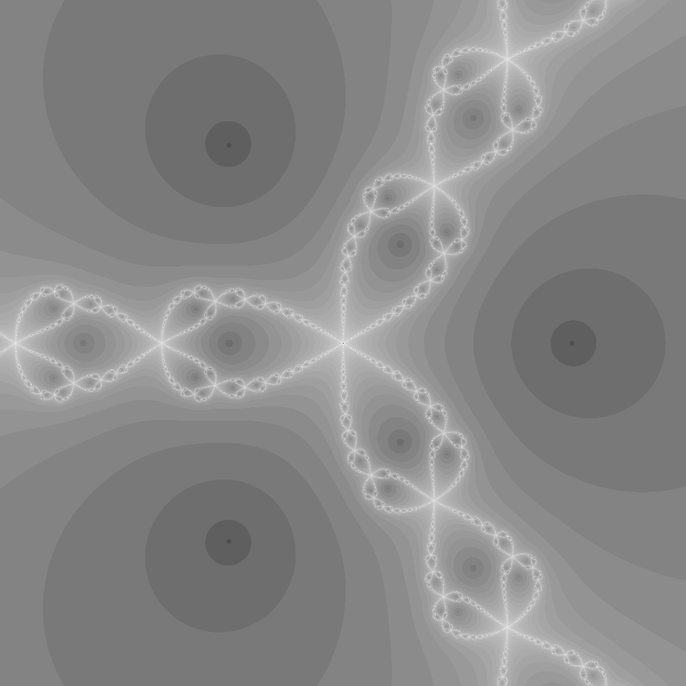

---
tags:
  - fractal
  - newton
---

# Newton Fractal (z^3 - 1)

## Summary
Basins of attraction for Newton's method applied to z^3 - 1 = 0. The three basins meet at the Julia set of the method.

## Formula / Rule
```
z \to z - \frac{z^3 - 1}{3 z^2}
```

## Mathematical Background
Basins of attraction for Newton's method applied to z^3 - 1 = 0. The three basins meet at the Julia set of the method.

## Rendering Method
Escape-time algorithm on CPU with 1024×1024 resolution.

## Parameters
| Setting | Value |
|---|---|
    | width | 1024 |
    | height | 1024 |
    | highest | 50 |

## Coloring Techniques
- log1p-mapped exposure

## C# Implementation Notes
- Implemented as a standalone fractal class in `Fractals/`

## Known Variations
- Default viewport and parameters as defined in `fractal_queue.json`

## Interesting Coordinates or Presets


## Sources
- Wikipedia: [Escape_time fractal](https://en.wikipedia.org/wiki/Escape-time_fractal)

## Related Notes
- [[mandelbrot]]
- [[julia]]
- [[burningship]]
