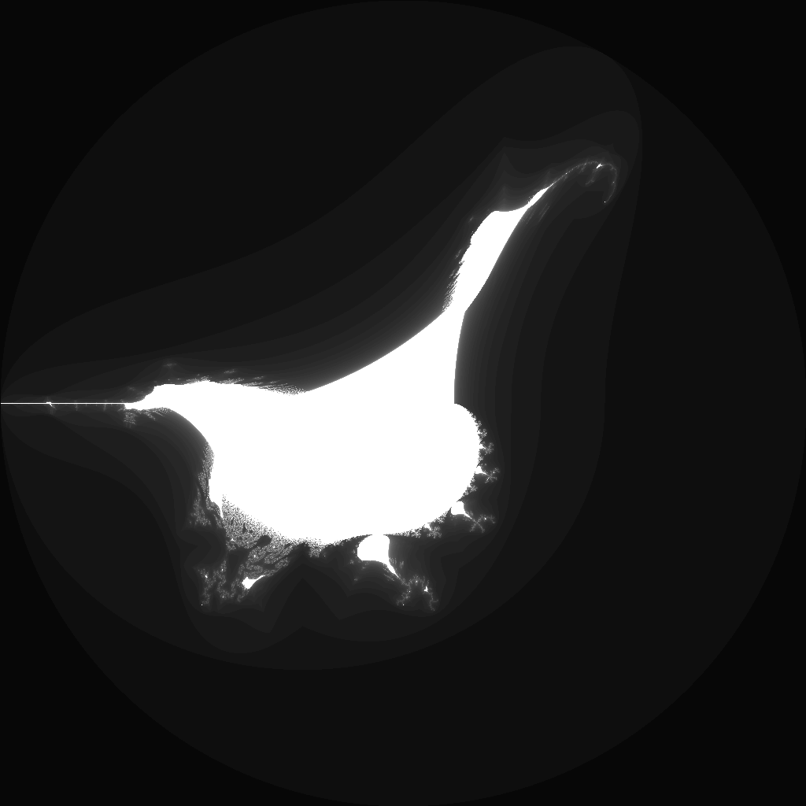

---
tags:
  - fractal
  - burningship
---

# Perpendicular Burning Ship

## Summary
A Burning Ship-family escape-time fractal that folds the imaginary component before squaring. The one-axis fold creates ship-like mirrored structures while preserving a different handedness from the real-fold perpendicular Mandelbrot.

## Formula / Rule
```
z_{n+1} = (\operatorname{Re}(z_n) + i|\operatorname{Im}(z_n)|)^2 + c, \quad z_0 = 0
```

## Mathematical Background
The Perpendicular Burning Ship is part of the family of absolute-value quadratic maps related to the [[burningship]] and [[perpendicular-mandelbrot]] variants.  The ordinary Burning Ship folds both coordinates before squaring; this variant folds only the imaginary coordinate.  That single-axis fold changes the symmetry of the parameter plane and tends to create cusped wakes, mirrored hull-like lobes, and boundary filaments with a different handedness than the real-axis perpendicular Mandelbrot.

Because the map still follows the escape-time template `z -> f(z) + c` with `z_0 = 0`, the rendered image is a parameter-plane set: each pixel is the complex parameter `c`, and color records how long the orbit remains bounded.

## Rendering Method
Escape-time algorithm on CPU with 1024×1024 resolution.

## Parameters
| Setting | Value |
|---|---|
    | width | 1024 |
    | height | 1024 |
    | bailout | 500 |
    | highest | 50 |
    | min-real | -2.0 |
    | max-real | 2.0 |
    | min-imaginary | -2.0 |
    | max-imaginary | 2.0 |

## Coloring Techniques
- log1p-mapped exposure

## C# Implementation Notes
- Implemented as a standalone fractal class in `Fractals/`
- Bailout set to 500 to limit orbit tracing

## Known Variations
- **Burning Ship:** folds both real and imaginary components before squaring.
- **Perpendicular Mandelbrot:** folds the real component before squaring.
- **Perpendicular Burning Ship:** folds the imaginary component before squaring, producing a complementary one-axis Burning Ship variant.

## Interesting Coordinates or Presets


## Sources
- Wikipedia: [Escape_time fractal](https://en.wikipedia.org/wiki/Escape-time_fractal)

## Related Notes
- [[mandelbrot]]
- [[julia]]
- [[burningship]]
