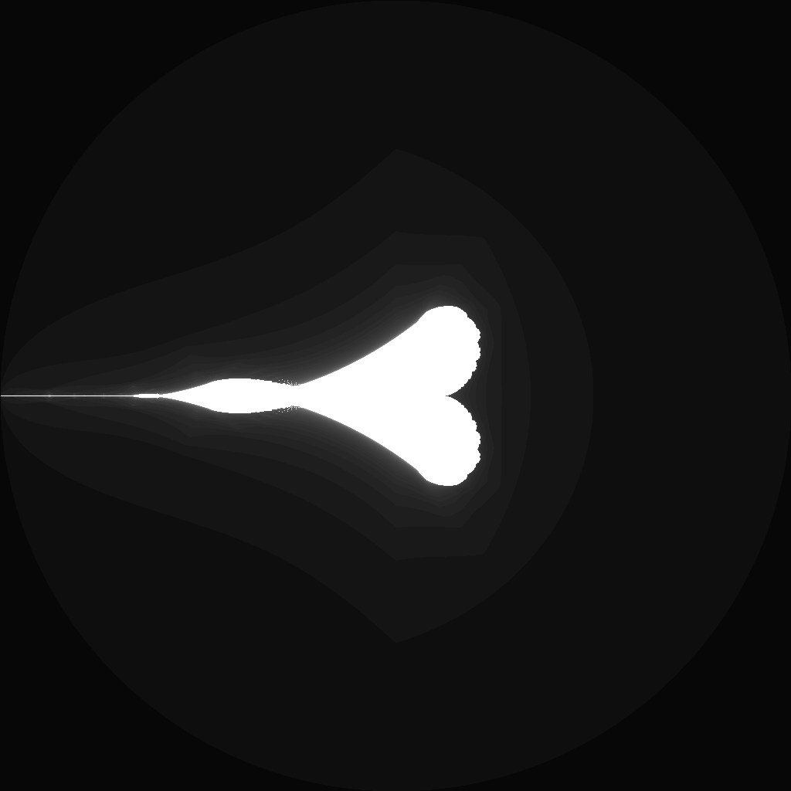

---
tags:
  - fractal
  - mandelbrot
---

# Perpendicular Mandelbrot

## Summary
A Mandelbrot-family escape-time fractal that folds only the real component of z before squaring. The perpendicular fold changes the symmetry of the quadratic map and produces vertical, ship-like tendrils along the boundary.

## Formula / Rule
```
z_{n+1} = (|\operatorname{Re}(z_n)| + i\operatorname{Im}(z_n))^2 + c, \quad z_0 = 0
```

## Mathematical Background
This map belongs to the non-analytic Mandelbrot-variant family created by inserting an absolute-value fold into the quadratic iteration. Folding only the real coordinate makes the critical orbit symmetric across the imaginary axis before squaring, so the image remains close to the classic quadratic escape-time construction while developing perpendicular, ship-like boundary filaments.

## Rendering Method
Escape-time algorithm on CPU with 1024×1024 resolution.

## Parameters
| Setting | Value |
|---|---|
    | width | 1024 |
    | height | 1024 |
    | bailout | 500 |
    | highest | 50 |
    | min-real | -2.0 |
    | max-real | 2.0 |
    | min-imaginary | -2.0 |
    | max-imaginary | 2.0 |

## Coloring Techniques
- log1p-mapped exposure

## C# Implementation Notes
- Implemented as a standalone fractal class in `Fractals/`
- Bailout set to 500 to limit orbit tracing

## Known Variations
- Default viewport and parameters as defined in `fractal_queue.json`

## Interesting Coordinates or Presets


## Sources
- Wikipedia: [Escape-time fractal](https://en.wikipedia.org/wiki/Escape-time_fractal)
- Wikibooks: [Fractals/Iterations in the complex plane](https://en.wikibooks.org/wiki/Fractals/Iterations_in_the_complex_plane)

## Related Notes
- [[mandelbrot]]
- [[julia]]
- [[burningship]]
