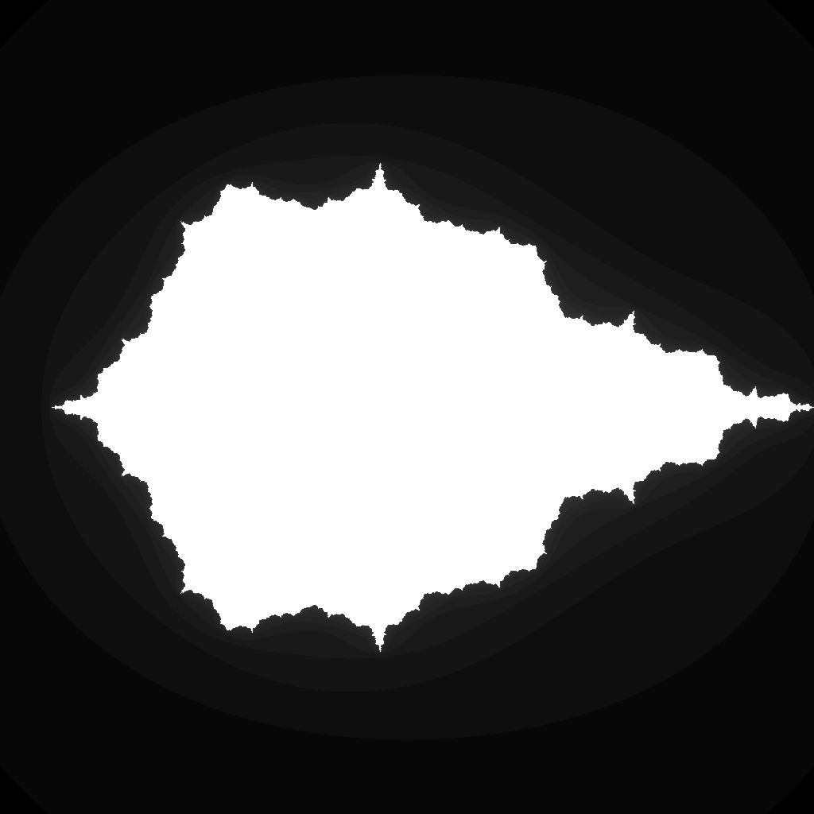

---
tags:
  - fractal
  - julia
---

# Phoenix Fractal

## Summary
A two-step Julia-family escape-time fractal where each new iterate depends on both the current and previous orbit values. The memory term produces bird-like wings, nested curls, and asymmetric filament structure.

## Formula / Rule
```
z_{n+1} = z_n^2 + c + p z_{n-1}, \quad c = -0.5, \quad p = -0.56667
```

## Mathematical Background
Phoenix fractals extend quadratic Julia iteration with a one-step memory term. Instead of depending only on `z_n`, each update also includes `z_{n-1}`, so the orbit has momentum: changing `p` changes how strongly the previous point pulls the next point away from the ordinary Julia dynamics. The preset `c = -0.5`, `p = -0.56667` is a real-coefficient Phoenix Julia slice with curled, wing-like boundary structure.

## Rendering Method
Escape-time algorithm on CPU with 1024×1024 resolution.

## Parameters
| Setting | Value |
|---|---|
    | width | 1024 |
    | height | 1024 |
    | bailout | 500 |
    | highest | 80 |
    | min-real | -1.5 |
    | max-real | 1.5 |
    | min-imaginary | -1.5 |
    | max-imaginary | 1.5 |

## Coloring Techniques
- log1p-mapped exposure

## C# Implementation Notes
- Implemented as a standalone fractal class in `Fractals/`
- Bailout set to 500 to limit orbit tracing

## Known Variations
- Varying `p` changes the memory feedback; real negative values often produce Phoenix-like wings and curled lobes.
- Complex `p` values rotate and shear the memory term, yielding less symmetric Julia slices.
- Different fixed `c` values move the render through connected, dendritic, and dust-like Phoenix Julia regimes.

## Interesting Coordinates or Presets


## Sources
- Wikipedia: [Escape_time fractal](https://en.wikipedia.org/wiki/Escape-time_fractal)

## Related Notes
- [[mandelbrot]]
- [[julia]]
- [[burningship]]
