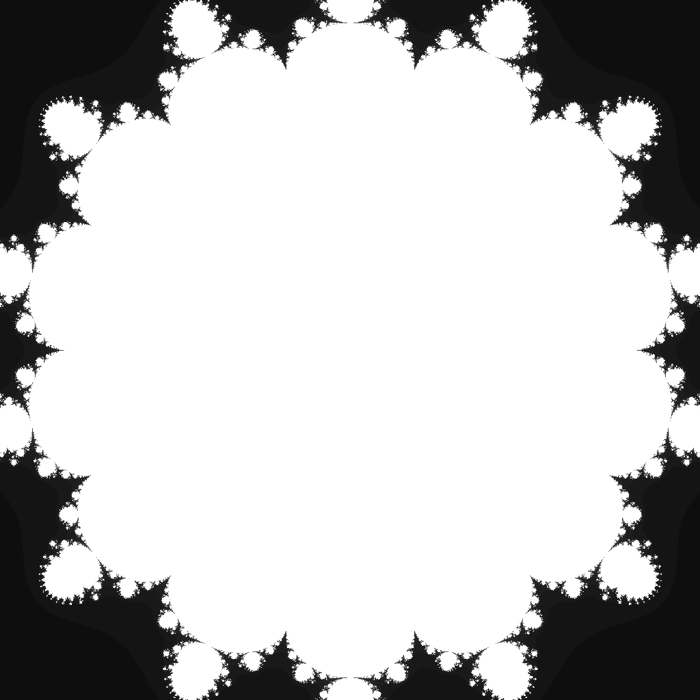

---
tags:
  - fractal
  - multibrot
---

# Quindecic Multibrot

## Summary
The degree-15 Mandelbrot-family parameter set. Raising each orbit to the fifteenth power produces fourteenfold rotational structure, a very compact central body, and hairline tendrils around the escape boundary.

## Formula / Rule
```
z_{n+1} = z_n^15 + c, \quad z_0 = 0
```

## Mathematical Background
A Multibrot set replaces the quadratic Mandelbrot update with \(z \mapsto z^d + c\). For integer degree \(d=15\), the connectedness locus has \((d-1)=14\)-fold rotational symmetry, so the visible arms are narrower and closer to the unit disk than lower-degree examples. The tight ±0.94 viewport keeps the compact central body and hairline satellites legible at the daily render size.

## Rendering Method
Escape-time algorithm on CPU with 1024×1024 resolution.

## Parameters
| Setting | Value |
|---|---|
    | width | 1024 |
    | height | 1024 |
    | bailout | 500 |
    | highest | 80 |
    | min-real | -0.94 |
    | max-real | 0.94 |
    | min-imaginary | -0.94 |
    | max-imaginary | 0.94 |

## Coloring Techniques
- log1p-mapped exposure

## C# Implementation Notes
- Implemented as a standalone fractal class in `Fractals/`
- Bailout set to 500 to limit orbit tracing

## Known Variations
- Default viewport and parameters as defined in `fractal_queue.json`

## Interesting Coordinates or Presets


## Sources
- Wikipedia: [Escape_time fractal](https://en.wikipedia.org/wiki/Escape-time_fractal)

## Related Notes
- [[mandelbrot]]
- [[julia]]
- [[burningship]]
