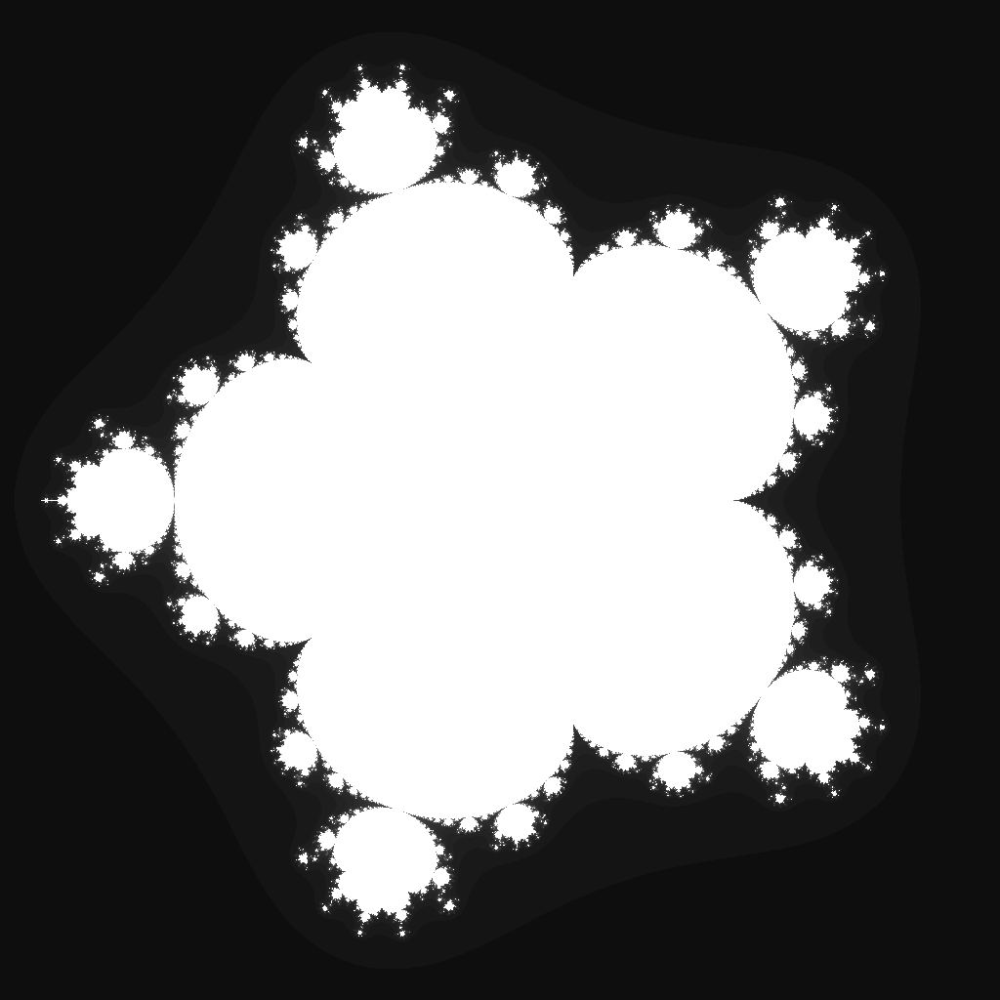

---
tags:
  - fractal
  - multibrot
---

# Sextic Multibrot

## Summary
The degree-6 Mandelbrot-family parameter set. Raising each orbit to the sixth power produces fivefold rotational symmetry, compressed lobes, and very thin exterior tendrils around the escape boundary.

## Formula / Rule
```
z_{n+1} = z_n^6 + c, \quad z_0 = 0
```

## Mathematical Background
Sextic Multibrot belongs to the generalized Multibrot family `z ↦ z^d + c` with degree `d = 6`. For integer degree `d`, the parameter-plane set has `(d - 1)`-fold rotational symmetry, so the sextic case forms five major lobes around the origin. As the degree increases, the connectedness locus becomes more compact and its exterior filaments narrow, making a tighter viewport useful for daily rendering.

## Rendering Method
Escape-time algorithm on CPU with 1024×1024 resolution.

## Parameters
| Setting | Value |
|---|---|
    | width | 1024 |
    | height | 1024 |
    | bailout | 500 |
    | highest | 80 |
    | min-real | -1.25 |
    | max-real | 1.25 |
    | min-imaginary | -1.25 |
    | max-imaginary | 1.25 |

## Coloring Techniques
- log1p-mapped exposure

## C# Implementation Notes
- Implemented as a standalone fractal class in `Fractals/`
- Bailout set to 500 to limit orbit tracing

## Known Variations
- Default viewport and parameters as defined in `fractal_queue.json`

## Interesting Coordinates or Presets


## Sources
- Wikipedia: [Escape_time fractal](https://en.wikipedia.org/wiki/Escape-time_fractal)

## Related Notes
- [[mandelbrot]]
- [[julia]]
- [[burningship]]
