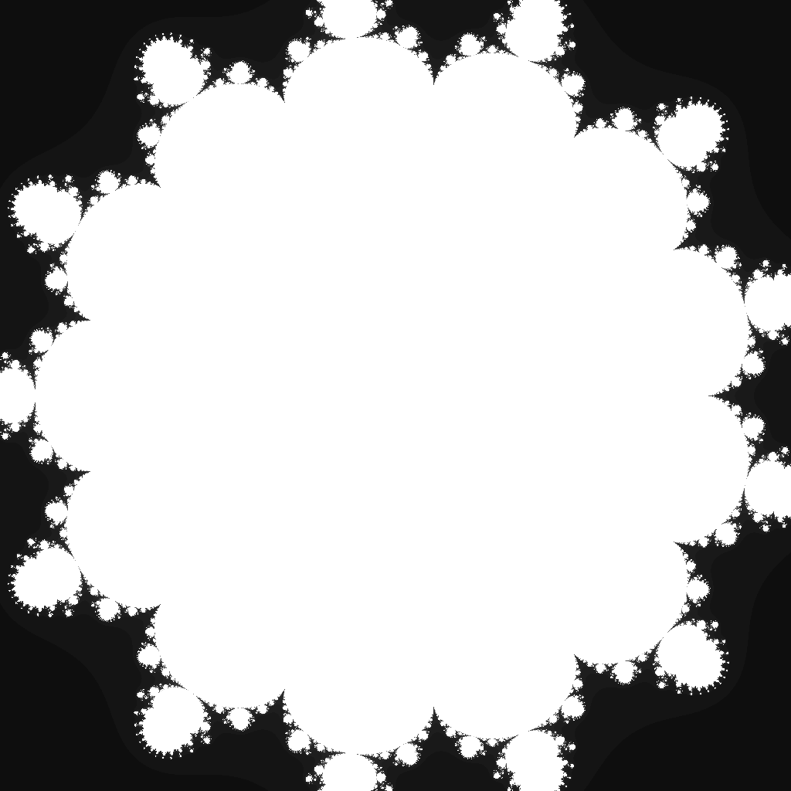

---
tags:
  - fractal
  - multibrot
---

# Tetradecic Multibrot

## Summary
The degree-14 Mandelbrot-family parameter set. Raising each orbit to the fourteenth power produces thirteenfold rotational structure, a very compact central body, and hairline tendrils around the escape boundary.

## Formula / Rule
```
z_{n+1} = z_n^14 + c, \quad z_0 = 0
```

## Mathematical Background
A Multibrot set generalizes the Mandelbrot iteration by using \(z \mapsto z^d + c\) instead of the quadratic map. For integer degree \(d=14\), the parameter plane has \((d-1)=13\)-fold rotational symmetry: thirteen narrow arms radiate from a compact central body, with tiny satellite bulbs and very high-iteration filaments close to the unit disk. The tight ±0.96 viewport keeps those arms large enough to render cleanly at the daily 1024×1024 size.

## Rendering Method
Escape-time algorithm on CPU with 1024×1024 resolution.

## Parameters
| Setting | Value |
|---|---|
    | width | 1024 |
    | height | 1024 |
    | bailout | 500 |
    | highest | 80 |
    | min-real | -0.96 |
    | max-real | 0.96 |
    | min-imaginary | -0.96 |
    | max-imaginary | 0.96 |

## Coloring Techniques
- log1p-mapped exposure

## C# Implementation Notes
- Implemented as a standalone fractal class in `Fractals/`
- Bailout set to 500 to limit orbit tracing

## Known Variations
- Default viewport and parameters as defined in `fractal_queue.json`

## Interesting Coordinates or Presets


## Sources
- Wikipedia: [Escape_time fractal](https://en.wikipedia.org/wiki/Escape-time_fractal)

## Related Notes
- [[mandelbrot]]
- [[julia]]
- [[burningship]]
