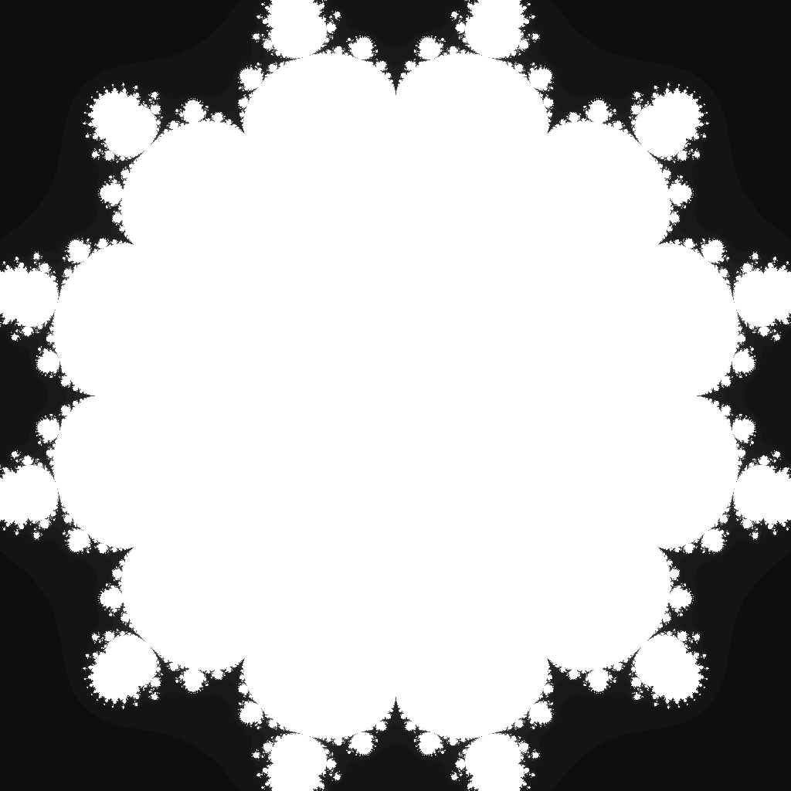

---
tags:
  - fractal
  - multibrot
---

# Tredecic Multibrot

## Summary
The degree-13 Mandelbrot-family parameter set. Raising each orbit to the thirteenth power produces twelvefold rotational structure, compact lobes, and extremely fine tendrils around the escape boundary.

## Formula / Rule
```
z_{n+1} = z_n^13 + c, \quad z_0 = 0
```

## Mathematical Background
A Multibrot set generalizes the Mandelbrot iteration by replacing the quadratic power with a degree \(d\) power: \(z \mapsto z^d + c\). For integer degree \(d=13\), the parameter plane has \((d-1)=12\)-fold rotational symmetry, so the main body appears as twelve narrow arms around a compact central structure. Higher powers concentrate the visually useful boundary near the unit disk, which is why this preset uses a tight ±0.98 viewport instead of the wider quadratic Mandelbrot frame.

## Rendering Method
Escape-time algorithm on CPU with 1024×1024 resolution.

## Parameters
| Setting | Value |
|---|---|
    | width | 1024 |
    | height | 1024 |
    | bailout | 500 |
    | highest | 80 |
    | min-real | -0.98 |
    | max-real | 0.98 |
    | min-imaginary | -0.98 |
    | max-imaginary | 0.98 |

## Coloring Techniques
- log1p-mapped exposure

## C# Implementation Notes
- Implemented as a standalone fractal class in `Fractals/`
- Bailout set to 500 to limit orbit tracing

## Known Variations
- Default viewport and parameters as defined in `fractal_queue.json`

## Interesting Coordinates or Presets


## Sources
- Wikipedia: [Escape_time fractal](https://en.wikipedia.org/wiki/Escape-time_fractal)

## Related Notes
- [[mandelbrot]]
- [[julia]]
- [[burningship]]
